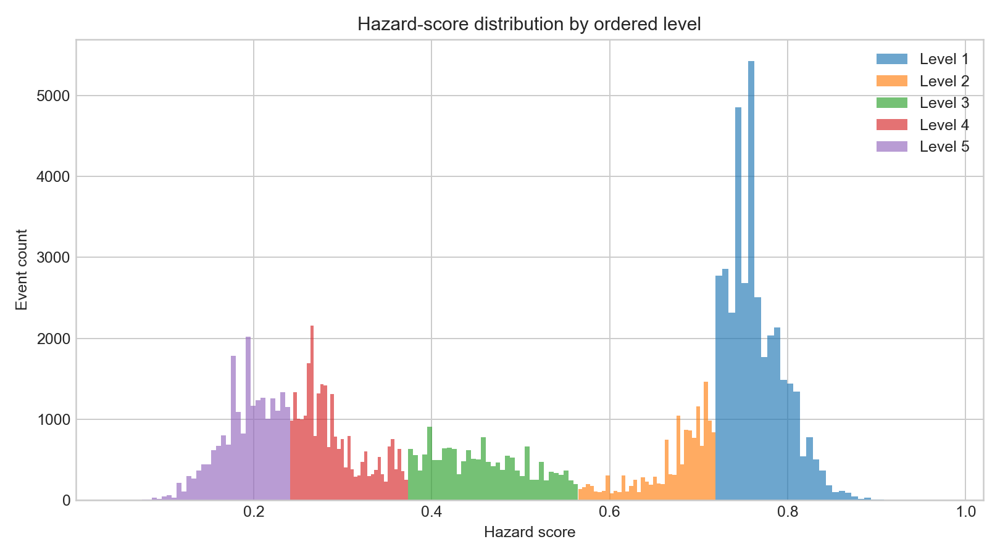
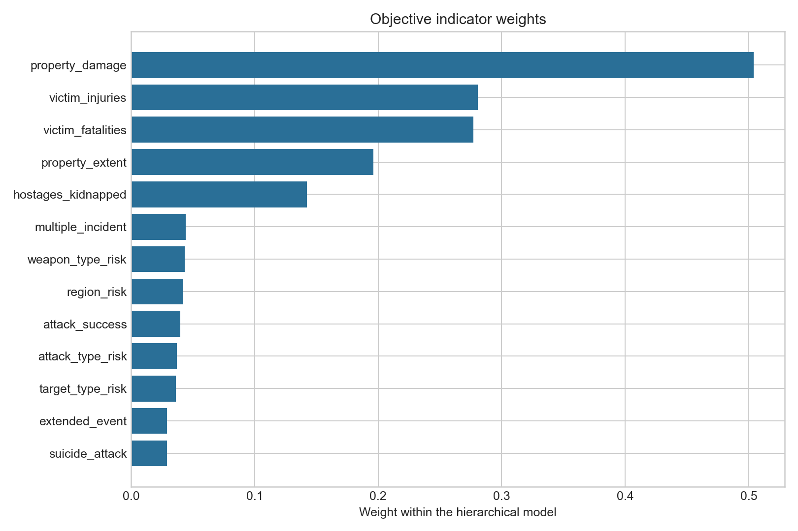

# 2018 年 C 题第一问优化模型


## 方法

1. 从死亡、受伤、绑架、财产损失、行动复杂性及事件情境构建指标；
2. 从总伤亡中扣除已记录的袭击者伤亡，对计数变量做 `log1p` 和百分位变换；
3. 类别编号不直接参与欧氏距离，而是用留一平滑历史危害风险编码；
4. 在人员伤亡、财产损失、行动复杂度和情境风险内部计算 CRITIC 权重；
5. 人员伤亡与财产损失取较高者构成“直接后果”，避免二者互相抵消；
6. 直接后果默认占 70%，其余 30% 由 CRITIC 在行动复杂度和情境风险间客观分配，并比较 60%/70%/80% 三种设定；
7. 只对一维危害得分聚为五组，按聚类中心从高到低标记一至五级；
8. 通过熵权法、PCA 和 Bootstrap 检查排序、等级与权重稳定性。

## 结果图

### 五级危害得分分布

不同颜色表示按聚类中心排序后的一至五级危害事件。一级事件的综合危害得分最高，五级最低。



### 客观指标权重

图中展示分层模型中的指标权重。人员伤亡和财产损失共同构成非补偿的“直接后果”维度，因此图中权重主要用于解释各指标在层级模型中的相对作用。



## 运行

```bash
python -m pip install -r requirements.txt
python main.py
```

在 Spyder 中打开 `main.py` 后，直接点击绿色运行按钮即可。程序始终以 `main.py` 所在目录为基准寻找 `附件1.xlsx`，无需调整 Spyder 的工作目录；运行时会在公屏实时显示数据读取、指标构造、模型计算、Bootstrap 进度和文件保存状态。全部结果统一写入同级的 `优化结果/` 文件夹。

快速检查可减少 Bootstrap 次数：

```bash
python main.py --bootstrap-runs 10
```

如需修改结果文件夹，可指定其他目录：

```bash
python main.py --output 优化结果
```

## 输出

- `优化结果/案件等级编号.xlsx`：保持原格式的事件编号与危害等级；
- `优化结果/降维之后各变量均值.xlsx`：包含五级统计、指标权重、十大事件、典型事件及验证结果；
- `优化结果/` 中同时包含完整分级、十大事件、典型事件、指标权重、验证与敏感性分析 CSV，运行摘要及图表。
