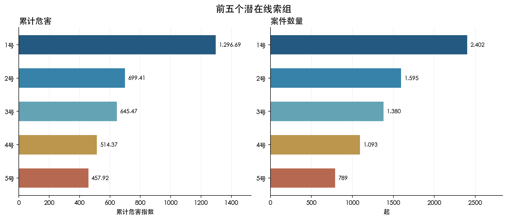
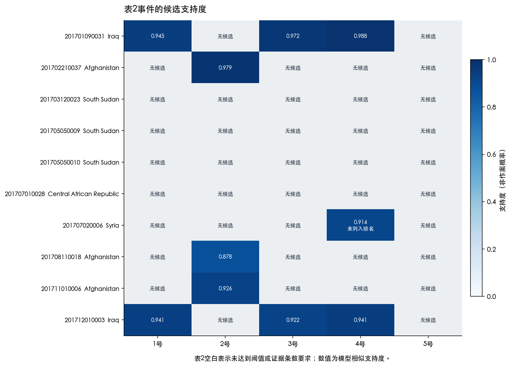
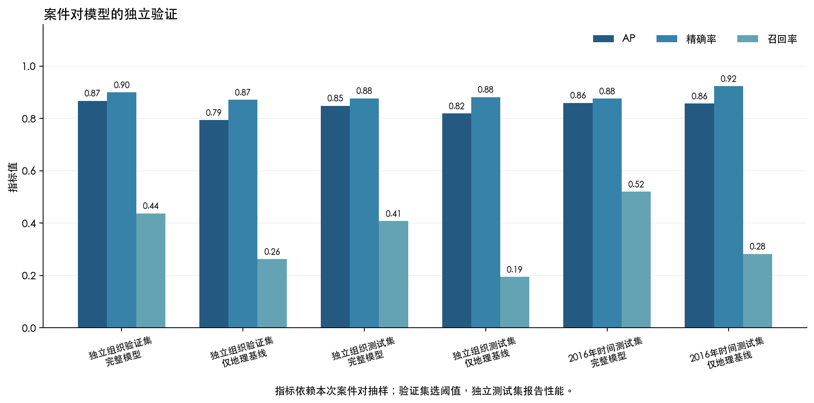
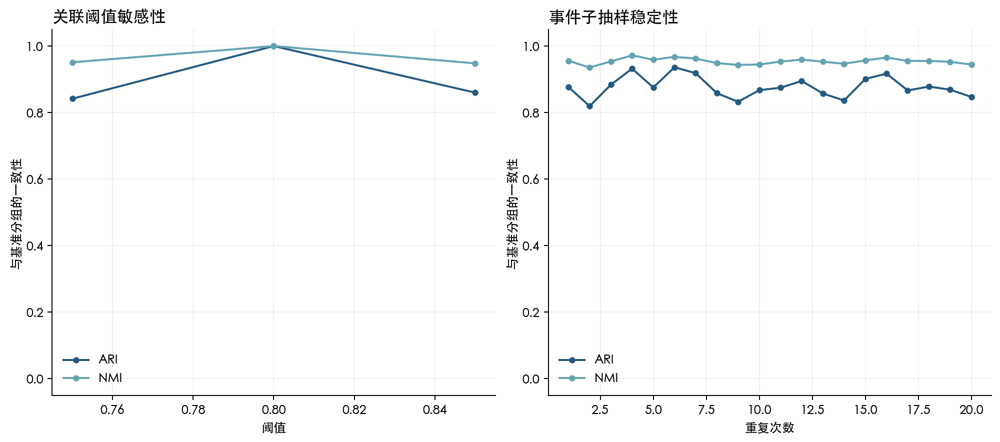

# 2018 年 C 题第二问：案件关联与嫌疑排序

本项目根据真题第二问，对 2015—2016 年尚未有组织或个人宣称负责的事件建立关联线索组，按累计危害选出前五组，并对表 2 的十起事件给出候选名次。**线索组是模型提出的待核查假设，不代表已经查明的真实组织。**

## 一键运行

在 Spyder 中打开本文件夹的 `main.py`，点击绿色运行箭头即可。无需选择代码、修改工作目录或输入命令行参数。运行阶段和检查进度会实时显示在控制台。

全部结果自动保存到本文件夹的 `优化结果/`，重复运行覆盖同名结果，不修改原始附件。Excel 结果只生成一个：`第二问分析结果.xlsx`。CSV 用于复核计算，图片用于 README 和论文。

如果提示缺少依赖，在终端进入本项目文件夹后执行：

```bash
python -m pip install -r requirements.txt
python main.py
```

程序从 `main.py` 所在目录寻找附件。第一问和第二问应保持仓库中的相邻目录结构，因为第二问复用第一问的危害标尺。

## 本次运行结果

默认参数下完成全量计算，耗时约 146 秒（本机环境，仅供参考），得到 **187 个线索组，其中 92 个为单件线索**。案件对阈值为 `0.80`，组级支持度阈值为 `0.85`。以下数字对应仓库当前保存的结果。

### 前五个重复作案线索组

| 嫌疑人代号 | 线索组 | 事件数 | 累计危害 | 主要国家 |
| --- | --- | ---: | ---: | --- |
| 1 | G0001 | 2,402 | 1,296.69 | 伊拉克 |
| 2 | G0002 | 1,595 | 699.41 | 阿富汗 |
| 3 | G0003 | 1,380 | 645.47 | 伊拉克 |
| 4 | G0004 | 1,093 | 514.37 | 伊拉克 |
| 5 | G0005 | 789 | 457.92 | 尼日利亚 |

主要国家仅描述事件分布；多个线索组可能来自同一国家，也不能据此认定其对应不同的真实组织。

### 表 2 候选名次

`—` 表示 Excel 中的空白，不是零概率。五号组没有达到接受条件的查询事件，也不会为了填满表格而强行排序。

| 事件编号 | 1 号 | 2 号 | 3 号 | 4 号 | 5 号 |
| --- | ---: | ---: | ---: | ---: | ---: |
| 201701090031 | 3 | — | 2 | 1 | — |
| 201702210037 | — | 1 | — | — | — |
| 201703120023 | — | — | — | — | — |
| 201705050009 | — | — | — | — | — |
| 201705050010 | — | — | — | — | — |
| 201707010028 | — | — | — | — | — |
| 201707020006 | — | — | — | — | — |
| 201708110018 | — | 1 | — | — | — |
| 201711010006 | — | 1 | — | — | — |
| 201712010003 | 2 | — | 3 | 1 | — |

5 起事件有候选，5 起事件留空。其中南苏丹三起、中非一起没有前五组内符合地理条件的参照；叙利亚事件虽有一个高分参照，但不足两条，因此仍留空。没有参照时，支持度表也保留空白，不把不可计算的值记成 `0`。

### 真实验证表现

| 检验 | 模型 | 案件对精确率 | 案件对召回率 | AP |
| --- | --- | ---: | ---: | ---: |
| 独立组织测试 | 完整模型 | 87.66% | 40.74% | 0.8484 |
| 独立组织测试 | 仅地理基线 | 88.17% | 19.43% | 0.8190 |
| 2016 年时间测试 | 完整模型 | 87.61% | 52.04% | 0.8595 |
| 2016 年时间测试 | 仅地理基线 | 92.33% | 28.23% | 0.8568 |

完整模型提高了召回率，**并未在每个指标上都超过地理基线**。90% 是验证集选阈值的目标，不能写成测试集也达到了 90%。

- 组级独立测试接受 16 个“查询—组织”候选，其中 15 个与标签一致，精确率 93.75%、召回率 55.56%；样本很小，不能当作表 2 真实识别率。
- 独立组织聚类子样本有 236 起事件，ARI 为 0.5759，聚类同组案件对精确率为 61.21%、召回率为 60.86%。说明组织拆分和误合并仍然存在。
- 对主分析中 8,141 条可核对归属的记录作事后检查，ARI 为 0.6103，同组对精确率 78.71%、召回率 53.31%。这只反映该可观察子集，不代表 Unknown 案件的正确率，也没有用于重新调参。
- 20 次事件子抽样的 ARI 中位数为 0.8752。关联阈值从 0.75 调至 0.85 时，组数从 124 变为 290，说明细分边界和组数仍对阈值敏感，不能仅凭较高稳定性指标宣称结果可靠。

## 数据口径

主输入为 `附件1.xlsx`，共 114,183 起事件。真题的“未宣称负责”与数据库中的“组织名 Unknown”不是同一概念：`gname` 是归属记录，`claimed` 是是否有人宣称负责。字段含义见 [GTD 官方代码本](https://www.start.umd.edu/sites/default/files/2024-10/Codebook.pdf)的组织归属与认领部分。

主分析条件：

```python
iyear in [2015, 2016]
claimed == 0
claim2 != 1 and claim3 != 1
```

| 核对项目 | 事件数 |
| --- | ---: |
| 2015—2016 年全部事件 | 28,552 |
| 明确未认领，且没有其他认领者 | 22,743 |
| 其中组织名 Unknown | 12,309 |
| 其中已有归属记录、但未认领 | 10,434 |
| 旧口径：2015—2016 年组织名 Unknown | 12,366 |
| 旧 `附件2.xlsx` 的事件数 | 12,355 |
| 旧附件中已经有人宣称负责的事件 | 46 |

因此不再直接把旧附件 2 当成主分析样本；它仅用于差异核对。旧附件 3 用于检查表 2 的十个事件编号，查询数据仍从原始附件 1 提取。题目原始“附件 2/3”与历史脚本加工后同名 Excel 不是同一类资料。

未知值保留其未知含义，不把 `claimed=-9` 当成无人认领，也不把缺失日期填成具体作案日。原始附件和第一问危害 CSV 的 SHA-256 保存在运行摘要中，方便核对版本。

## 模型

### 1. 从可靠来源学习案件关联

训练来源必须有明确组织名、`guncertain1=0`、无第二/第三组织、不是已标记的个人行动，且 `claimed=1`。排除 “Maoists”“Left-wing extremists”等不能代表唯一组织的泛称。筛选后有 4,935 条来源记录；只有至少四起事件的组织进入后续整组划分。它们与 22,743 起主分析事件没有编号重叠。

使用同组织事件构造正案件对，不同组织构造负案件对。每组织最多抽 240 对正例，负例近似等量，并尝试加入同国家、相同袭击/武器方式的困难负例。实际抽样比例另行输出，精确率和 AP 必须结合这一抽样口径解读。

案件对特征包括：

- 国家、省份、袭击方式、目标、武器和行动标记是否一致；
- 每个字段是单边缺失还是双边缺失；
- 地理距离和日期间隔的 `log1p` 变换及缺失标记。

类别编号只用于判断是否相同，不直接当作连续数值计算距离。组织名只作监督标签，摘要可能泄露组织信息，因此不进入特征。死亡、受伤和财产损失也不进入关联模型，只在分组后评价危害。

模型为直方图梯度提升分类器。模型输出 $s_{ij}$ 是案件对相似分，**不是某组织真实作案概率**。

### 2. 独立验证与阈值选择

组织按固定随机种子 `2025` 划为训练、验证、测试三部分，比例约 60%/20%/20%。

- 训练：仅使用训练组织的 2015 年事件；
- 组织验证：使用未参与训练的验证组织，选择阈值；
- 组织测试：使用另一批未见组织，只报告指标；
- 时间测试：使用训练中出现过的组织的 2016 年事件，只报告指标。

各集合事件互不重叠。组织验证集包含 2015—2016 年数据，因此“时间测试”是模型训练事件的时间留出，**不是所有模型选择都发生于 2015 年末的严格回测**。最终使用验证时的同一个冻结模型，不在全数据上重新拟合。

阈值在预设网格中选择：优先达到 90% 的验证精确率，再取召回率较高者；若没有阈值达标，会如实记录，而不声称达到目标。另输出只使用地理信息的基线、同国案件压力测试、分数分箱检查及已知组织的端到端聚类评估。

聚类评估使用 ARI、NMI 和同组案件对的精确率/召回率，而不是把自己生成的聚类标签当真值，再以分类准确率证明分组正确。指标含义参见 [scikit-learn 聚类评估文档](https://scikit-learn.org/stable/modules/clustering.html#clustering-performance-evaluation)。

### 3. 候选图与线索组

将地理近邻、同国家时间近邻、同国家/省份时间近邻、同国家/作案方式时间近邻合并为候选案件对，只保留相似分超过验证阈值的边。

在加权图上使用 Louvain 社区划分，固定分辨率 `1.2`。没有高分关联的案件保留为单件线索，不强制塞入某个组织。一个社区可能混合多个组织，也可能只是一个大组织的一部分。

默认近邻数为 `20`。跨国候选限于 300 km 内的地理近邻；这一计算约束可能遗漏远距离跨国行动。大组查询最多考察同国家的 600 个时间近邻及 300 km 内的 200 个地理近邻。

### 4. 危害排序与前五名

复用第一问的连续危害得分 $h_i$，按组内累计危害排序：

$$
H_g=\sum_{i\in G_g}h_i.
$$

至少包含两起事件的线索组才进入重复作案候选前五名。累计危害由高到低对应 1—5 号嫌疑人，并列时按最小事件编号确定顺序。另输出平均危害、最高单次危害的排序，展示“累计危害”对作案次数的偏重。

第一问标尺使用全时期样本，是回顾性危害评价；不会把它当成 2015 年当时可获得的预测特征。

### 5. 表 2：支持度、拒识与名次

对查询事件 $q$ 与候选组 $G_g$ 的参考案件计算相似分，取最高的至多三个分数求均值：

$$
A(q,g)=\frac{1}{k}\sum_{j\in T_k(q,g)}s_{qj},\qquad k=\min(3,\text{候选参照数}).
$$

只有同时满足以下条件，才填写该候选的名次：

1. 最高三条参考中至少两条达到案件对阈值；
2. 平均支持度达到独立组级验证选定的阈值。

组级阈值用留出组织的“2015 年参考事件、2016 年查询事件”确定，并在另一批留出组织上测试。已知组织参考组与未知社区仍有差别，验证性能不能直接视为表 2 的真实身份识别率。

**表 2 每一列固定代表某个嫌疑人，单元格填写名次。** 例如，3 号最相似、1 号次之，则 3 号列填 `1`，1 号列填 `2`。没有足够支持的候选留空；空白不表示概率为零，也不表示已排除其他组织。

## 结果文件

`优化结果/第二问分析结果.xlsx` 汇总主要结果与审计表：

| 内容 | 用途 |
| --- | --- |
| 表 2 嫌疑排序、嫌疑支持度 | 十起事件的候选名次、得分与拒识原因 |
| 前五线索组、全部线索组、案件分组明细 | 危害排序及每起事件所属线索组 |
| 相似案件证据 | 查询事件对应的高分参考事件编号 |
| 案件对、同国案件、组级与聚类验证 | 独立检验及地理基线对比 |
| 目标已有归属核对 | 目标集中可靠归属子集的事后结构诊断，不用于调参 |
| 阈值敏感性、事件子抽样稳定性 | 参数扰动与重复抽样后的分组变化 |
| 筛选口径、旧附件差异、训练验证事件清单 | 核对样本来源、数据隔离和历史文件差异 |

Excel 保存计算快照，不是可修改单元格后自动重算的模型；更新附件或参数后重新运行 `main.py`。对应 CSV 保留详细数据，`run_summary.json` 保存参数、来源校验值和限制说明。

## 结果图

### 前五组的累计危害与事件数



### 表 2 候选支持度

图中展示相似支持度，不是归责概率；是否填写名次还要同时满足高分参照数要求。



### 独立验证与地理基线



### 分组稳定性

默认进行 20 次 80% 无放回事件子抽样。每次保留冻结模型和原候选图的诱导子图再划分，用来检查分组变化。**这不是模型重训 Bootstrap，也不能证明组织识别正确。**



## 复现与测试

主要文件：`main.py` 组织流程，`association.py` 完成案件关联和验证，`reporting.py` 统一导出结果。三个文件都需保留在同一文件夹，只运行 `main.py`。

在本文件夹运行边界测试：

```bash
python -m unittest discover -s tests -v
```

如只想快速检查流程，可将事件子抽样次数减少为 3：

```bash
python main.py --stability-runs 3
```

正式结果使用默认 20 次；改变参数会覆盖同名结果，README 中的本次数值不会自动更新。不同依赖版本可能使模型或社区边界略有变化，具体依赖要求见 `requirements.txt`。
