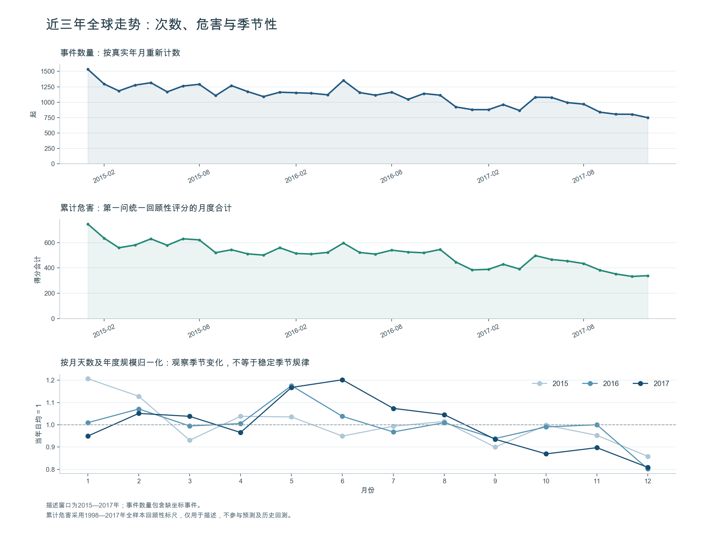
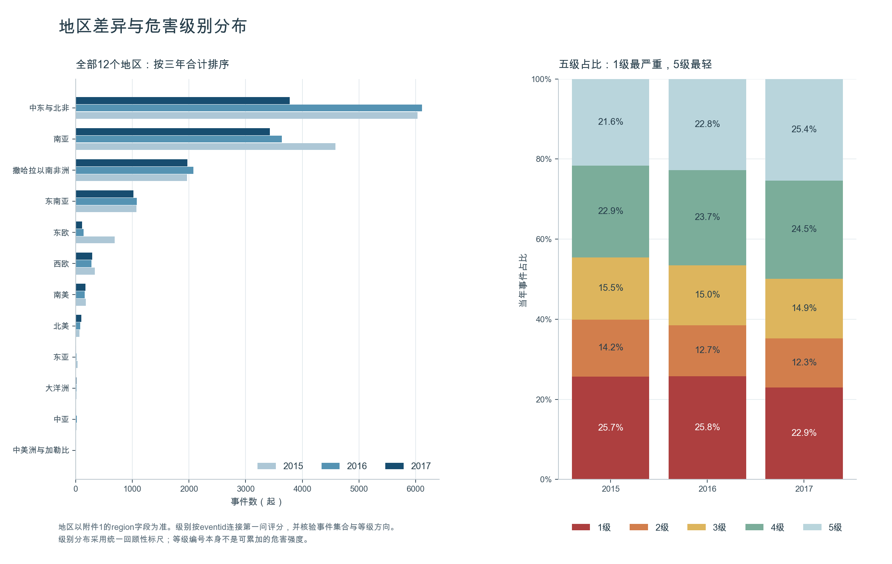
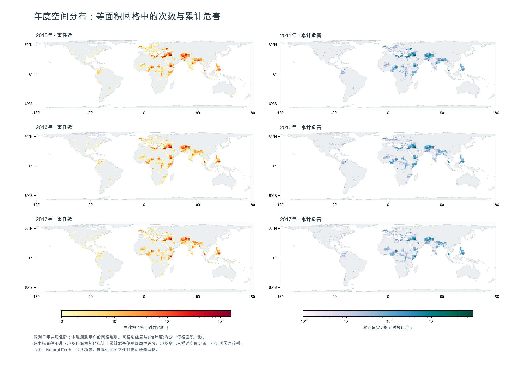
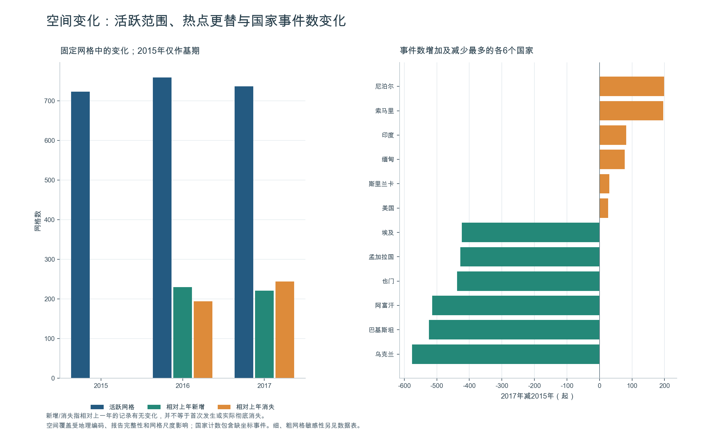
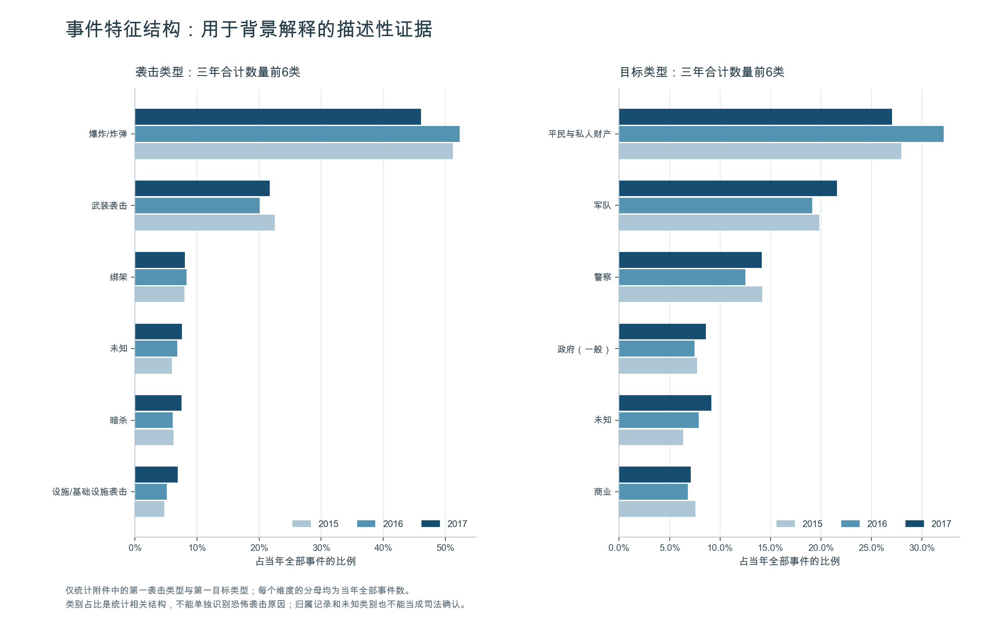
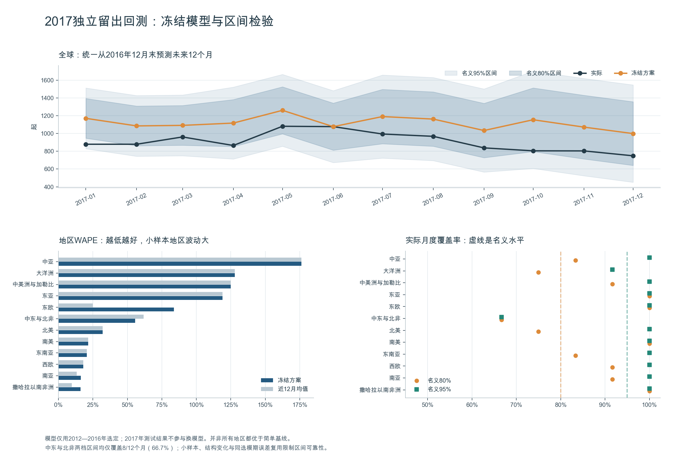
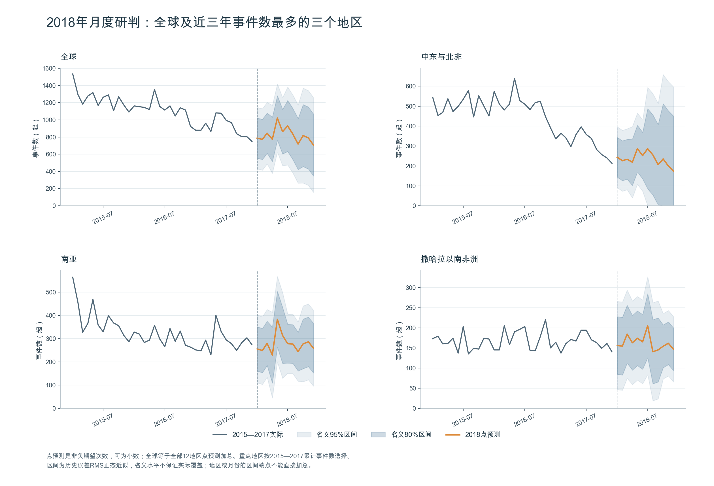
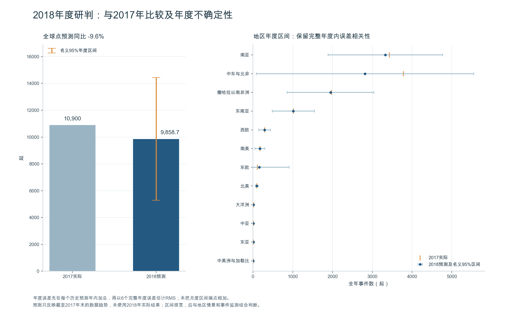

# 2018 年 C 题第三问：恐袭规律与 2018 年态势研判

依据[竞赛真题](../数学建模数据分析类真题/2018年中国研究生数学建模竞赛C题.doc)，研究 **2015—2017 年**的事件特征、时空分布、空间变化和五级分布，并预测 **2018 年全球及十二地区的事件数量**。模型的时间截点固定为 2017 年末，不随当前日期改变。

本次完整运行得到：2018 年全球点预测 **9,858.7 起**，较 2017 年下降约 **9.6%**；名义 95% 年度预测区间为 **[5,282.2，14,435.2] 起**。2017 年独立回测的全球月度 MAE 为 **209.23 起**，比季节朴素基线降低 **6.56%**。预测仍有较大误差，部分地区没有超过简单基线。

## 一键运行

在 Spyder 中打开本目录的 **`main.py`**，点击绿色运行箭头。无需参数、选择代码或手动切换工作目录。程序实时显示读数、回测、绘图和保存进度，结果全部写入 **`优化结果/`**。

程序还读取相邻第一问的 `附件1.xlsx` 做版本核验，并使用该问已有的 `优化结果/案件危害分级.csv` 连接危害评分；仓库当前已包含这两个文件，不必重跑第一问。上传或复制项目时请保留两问的相邻目录结构、本目录的辅助模块及上述依赖。

缺少依赖时，在 **Spyder 实际使用的 Python 环境**安装：

```bash
python -m pip install -r requirements.txt
python main.py
```

本机已用 Spyder 配置所指向的 `/opt/anaconda3/bin/python`，从项目外的 `/private/tmp` 完整运行通过，清理旧文件后重跑耗时约 **46 秒**。已测试 Python 3.13、NumPy 2.1.3、pandas 2.2.3、SciPy 1.15.3、statsmodels 0.14.4、Matplotlib 3.10.0、openpyxl 3.1.5。具体版本与耗时以[运行摘要](优化结果/run_summary.json)为准。图形使用独立离屏画布，不阻塞运行或改变 Spyder 后端。

重复运行覆盖 `优化结果` 内的同名产物；原始附件和相邻第一问数据只读，其他项目不受影响。运行不联网，地图轮廓和资料链接已随项目保存。

## 数据核验与旧逻辑修复

主输入是本目录 **`附件1.xlsx`**，1998—2017 年共 **114,183** 起事件，主键唯一。第一问、第三问的附件 1 二进制 SHA-256 完全一致；评分连接前还检查事件集合、唯一性、得分范围与等级方向。输入、评分和代码哈希保存在运行摘要中。

下面涉及旧月表、旧空间表、旧热力表的差异，均为**清理旧文件前已完成的历史核验结论**。旧加工表已删除，当前程序不再读取它们；每次运行都从原始附件重新生成统计与预测。

| 核对项 | 核实结果与处理 |
| --- | --- |
| 近三年数量 | 2015 年 14,965；2016 年 13,587；2017 年 10,900，共 39,452 起 |
| 旧月表顺序 | 原顺序按月份优先交错年份；新版从原始事件按真实年月汇总并排序 |
| 2016 年 9 月 | 原始附件 1,045 起，旧月表误记 1,145 |
| 2017 年 3 月 | 原始附件 961 起，旧月表误记 960 |
| 旧空间表 | 36 条有效记录实际为 12 地区 × 3 年；新版重建 12 地区 × 36 月面板 |
| 有效坐标 | 39,244 起，缺失 208 起；缺坐标仅不进入空间统计，其他统计全部保留 |
| 坐标清洗 | 不填 `(0,0)`；双零、越界、缺失分别标记；单独的纬度 0 或经度 0 允许保留 |
| 旧热力表少两行 | 其坐标序列恰等于原始近三年数据去掉前两行并填零后的序列 |
| 旧预测起点 | 改为同一历史截点一次预测未来十二个月，不再每隔三行取一次一步预测 |

旧热力表少掉的前两行编号为 `201412030034` 和 `201412220095`，实际日期字段分别为 **2015-01-03** 和 **2015-01-01**。事件编号不是日期字段，不能按编号前缀筛选年份。旧文件缺少主键，序列核对能定位遗漏位置，不能唯一证明原作者的筛选动机。

原始附件近三年没有缺失月份。只有确认全球各月存在观测后，才将地区无记录的月份补为 0；整月缺失会报错。空月平均危害及占比留空，伤亡未知不填零。表中的“已记录死亡人数”是已知总死亡值之和，包含数据库记录的袭击者死亡，并有信息覆盖率伴随输出。

第三问目录顶层的旧预测文件已删除，**唯一结果工作簿为 `优化结果/2018年预测结果.xlsx`**；上述历史差异保留在本文中，不再作为运行输入或单独输出旧表核对文件。

旧 `附件2.xlsx` 经核验是筛选、数值缩放后且缺少事件编号的加工表（23,837 行 × 9 列），不是真题中的变量说明附件，已一并清理。本目录保留用于重算的原始 `附件1.xlsx`。

## 近三年规律

### 时间与级别

| 年份 | 事件数 | 较上年 | 平均危害得分 | 一级事件占比 | 有事件国家数 |
| --- | ---: | ---: | ---: | ---: | ---: |
| 2015 | 14,965 | — | 0.4716 | 25.67% | 99 |
| 2016 | 13,587 | −9.21% | 0.4645 | 25.80% | 108 |
| 2017 | 10,900 | −19.78% | 0.4453 | 22.93% | 102 |

总量下降与地理覆盖变化并不同步。一级占比在 2016 年略升、2017 年下降，不能仅凭次数判断事件严重程度。季节性图先除以当月天数，再除以当年日均水平，减少月份长度和年度规模差异；只有三个描述年度，不据此宣称稳定的季节高峰。



危害使用第一问连续得分 $h_i\in[0,1]$，累计危害和平均危害分别为：

$$
H_{r,t}=\sum_{i\in(r,t)}h_i,\qquad \bar h_{r,t}=H_{r,t}/N_{r,t}.
$$

一级最严重，五级最轻，**不将等级编号相加**。该评分由第一问全时期样本建立，是统一的回顾性描述标尺；不进入历史计数预测，不声称是历史当时已经可用的评分器。旧“月份危害度”“空间危害度”因口径不可追溯而停用，也不以这个全样本分数做存在泄漏的危害预测回测。

### 地区差异和空间变化

2015—2017 累计事件数最多的三个地区为中东与北非 **15,931** 起、南亚 **11,654** 起、撒哈拉以南非洲 **6,011** 起，合计占 **85.16%**。这是选择重点展示地区的可复现依据；预测实际覆盖全部十二地区。



空间统计采用经度 × $\sin(\text{纬度})$ 等分的 **180 × 90 等面积格网**，每格约 31,486 平方公里。事件密度使用格内事件数，危害强度使用格内连续得分之和，同一列三年共用对数色阶。另输出 90 × 45、360 × 180 的尺度敏感性结果。



| 年份 | 活跃格数 | 相对上年新增格 | 相对上年消失格 | 前十格事件占比 |
| --- | ---: | ---: | ---: | ---: |
| 2015 | 723 | — | — | 30.18% |
| 2016 | 759 | 230 | 194 | 36.22% |
| 2017 | 736 | 221 | 244 | 32.58% |

2017 年仍有 425 起事件落在上一年没有记录的格内，同时有 244 个上年活跃格当年无记录，表现为扩张与收缩并存。新增格不等于历史首次发生，消失格不等于风险归零。格网重叠率、集中度及事件增减用于描述**空间重分布**，不能识别因果传播链，也不能从全球经纬度均值推断移动方向。

国家层面，2017 较 2015 年事件增量靠前的包括尼泊尔 **+199**、索马里 **+196**、印度 **+82**。国家统计保留缺坐标事件。缺少人口和设施暴露分母，因此这些计数不是个人遇袭概率。



## 原因分析与反恐建议

事件表没有未发生事件的对照样本，也没有完整的个体招募、冲突强度和人口暴露数据，无法单靠时序模型识别成因。本项目把**事件构成、外部研究中的背景机制、可检验的因果结论**分开。

- **冲突与治理背景。** IEP 的 [Global Terrorism Index 2017](https://www.visionofhumanity.org/wp-content/uploads/2020/10/Global-Terrorism-Index-2017.pdf)（2017 年 11 月，主要统计截至 2016 年）讨论冲突、政治排斥与群体不满等背景。这与本附件中三个重点地区高度集中的现象相容，但不证明地区本身导致恐袭。建议优先配置民用设施保护、急救和事件核实资源，并结合当地资料评估。
- **方式与目标。** 附件中爆炸/炸弹占近三年事件的 **50.2%**，平民与私人财产是第一目标类型的最多类别，占 **29.2%**。这支持按目标和方式构成配置应急预案与救治能力；特征占比不是发生原因。分级得分本身含情境风险编码，也不能用得分差异反向证明类别致害。
- **招募和社会排斥。** [UNDP 2017 非洲极端主义研究](https://www.undp.org/publications/journey-extremism-africa)（2017-09-07，第 73 页相关讨论）报告了受访者的治理不满和触发事件。它支持依法执法、社区预防、申诉沟通及重返社会支持的背景讨论；访谈结果不能外推为全球因果概率。
- **跨地区变化。** [安理会第 2396 号决议通过说明](https://press.un.org/en/2017/sc13138.doc.htm)（2017-12-21）关注人员回流、转移及软目标风险。结合新增活跃格和国家增量，应在全球总量下降时继续监测局部增长，依法共享可核实线索；本项目未识别实际人员移动轨迹。
- **资源规划。** 2018 点预测倾向下降，但区间较宽、地区验证不均衡。应以低、中、高需求情景保留应急容量，不能据一个点预测直接撤减能力。现实应用应随新观测更新模型，另行评估政策成效。

以上背景材料均在 2017 年末前公开；2018 实际结果和后来新闻没有进入模型。软件和验证方法的现代文档仅作实现参考。完整资料清单含发布日期、信息范围、用途及链接，见 [sources.json](sources.json) 和工作簿“参考资料”。



## 预测模型与检验设计

### 候选与模型选择

历史计数面板从 **2007-01 至 2017-12**，共 132 个月 × 12 地区。四个候选在每个预测起点最多使用过去 60 个月：

| 模型 | 固定形式 |
| --- | --- |
| 季节朴素 | 未来第 $h$ 月等于去年同月 |
| 近 12 月均值 | 十二步均为训练期最后十二个月的平均值 |
| 阻尼季节 ETS | 加性趋势、阻尼趋势、加性季节项，周期 12 |
| 低阶 SARIMA | $(0,1,1)\times(0,1,1)_{12}$，无漂移 |

每次从前一年 12 月末统一预测随后十二个月，回测年份为 **2012、2013、2014、2015、2016**。按这 60 个误差的 MAE 选择地区模型，同分优先简单模型；再将地区加总候选与四个直接全球模型比较，选取全球方案。该选模期误差用于选择，不能当独立测试成绩。全套规则随后冻结，仅使用 **2017 年完整十二个月**作为独立留出。

本次选择：北美、中美洲与加勒比、南美、东亚、中亚、西欧、大洋洲使用近 12 月均值；东南亚、东欧、撒哈拉以南非洲使用阻尼季节 ETS；南亚、中东与北非使用低阶 SARIMA。全球选择地区加总，其选模期 MAE 为 **198.96**，直接全球 SARIMA 为 **222.46**。

若其他输入下直接全球模型入选，程序按初始地区预测占比协调到全球；地区总预测为零时使用训练期末十二个月占比。本次全球采用地区加总，不需额外调整。所有点预测截断至非负。优化不收敛的候选明确排除；最终拟合异常按预先约定回退季节朴素，并记录异常。本次无拟合失败。

### 独立 2017 回测

| 全球方案 | 月度 MAE | 月度 RMSE | WAPE |
| --- | ---: | ---: | ---: |
| 冻结的地区加总 | 209.23 | 225.46 | 23.03% |
| 季节朴素基线 | 223.92 | 235.89 | 24.65% |
| 近 12 月均值基线 | 223.92 | 246.49 | 24.65% |

$$
\mathrm{MAE}=\frac1n\sum_t|y_t-\hat y_t|,\quad
\mathrm{RMSE}=\sqrt{\frac1n\sum_t(y_t-\hat y_t)^2},\quad
\mathrm{WAPE}=\frac{\sum_t|y_t-\hat y_t|}{\sum_t y_t}.
$$

全球名义 80%/95% 月区间分别覆盖 **11/12（91.67%）**和 **12/12（100%）**个月。但全球平均偏差为 **+209.20 起/月**，表明对 2017 年仍明显高估。中东与北非的两档区间覆盖均只有 **8/12（66.67%）**；南亚、东欧、撒哈拉以南非洲的冻结方案未超过均值基线。没有根据这些测试结果重新挑选模型。



### 预测区间

对每个地区以及协调后的全球，使用历史完整年度十二步误差 $e_{j,h}=y_{j,h}-\hat y_{j,h}$。按步长的四个季度合并误差：

$$
s_q=\sqrt{\frac{1}{3J}\sum_{j=1}^{J}\sum_{h=3q-2}^{3q}e_{j,h}^{2}},
\quad I_{h,1-\alpha}=\left[\max(0,\hat y_h-z_{1-\alpha/2}s_q),\ \hat y_h+z_{1-\alpha/2}s_q\right].
$$

年度区间先把每个预测年内误差相加，再计算 $s_A=\sqrt{J^{-1}\sum_j(\sum_h e_{j,h})^2}$，保留月际误差相关性。全球区间先加总地区预测后计算全球残差，**不将地区区间端点相加**。

2017 测试区间只使用 2012—2016 误差（$J=5$）；完成独立检验后，2018 区间可加入 2017 误差（$J=6$），但点预测方案不改。区间是历史 RMS 的正态近似，复用选模期误差会有乐观偏差；小样本、偏差、非平稳和突发冲击均可能使实际覆盖偏离名义水平，**不是保证覆盖率的独立校准区间**。

### 2018 年结果

截至 2017-12 重新拟合冻结方案，输出连续的 2018-01 至 2018-12。点预测为期望次数，可包含小数。

| 范围 | 2017 实际 | 2018 点预测 | 相对 2017 | 名义 95% 年度区间 |
| --- | ---: | ---: | ---: | ---: |
| 全球 | 10,900 | 9,858.7 | −9.6% | 5,282.2—14,435.2 |
| 中东与北非 | 3,780 | 2,816.9 | −25.5% | 82.2—5,551.5 |
| 南亚 | 3,430 | 3,327.8 | −3.0% | 1,887.7—4,767.9 |
| 撒哈拉以南非洲 | 1,970 | 1,949.1 | −1.1% | 858.3—3,039.9 |

全球名义 80% 年度区间为 **6,866.3—12,851.1**。十二地区月度点预测加总等于全球，年度点预测等于十二个月点预测之和。区间端点不具有这种可加性。





## 结果与复现

| 文件 | 内容 |
| --- | --- |
| [2018年预测结果.xlsx](优化结果/2018年预测结果.xlsx) | 唯一新版工作簿，17 个主要工作表：预测、回测、选模、年度统计、级别、空间、核对、资料和建议 |
| [分析报告.md](优化结果/分析报告.md) | 同次运行生成的数值、态势解释与建议 |
| [csv/](优化结果/csv/) | 全部计算表；包括地区月度面板、候选逐月回测、误差尺度、国家/类型/地区级别、网格及事件核验明细 |
| [figures/](优化结果/figures/) | 八张中文静态图，GitHub 可直接显示 |
| [运行日志.txt](优化结果/运行日志.txt) | 实时进度的完整记录 |
| [run_summary.json](优化结果/run_summary.json) | 输入与代码哈希、依赖、参数、实际指标和核验状态 |

Excel 是 Python 模型的计算快照，修改 Excel 单元格不会自动重算模型；更新输入后重新运行 `main.py`。CSV 保留完整浮点精度，图表及 README 数字仅作显示舍入。

除上表中的新版结果外，复现所需文件如下：

| 文件或目录 | 用途 |
| --- | --- |
| `main.py` | 唯一完整运行入口 |
| `data_analysis.py`、`forecasting.py` | 原始数据核验与统计、预测与验证 |
| `reporting.py`、`conclusions.py` | 绘图、工作簿与分析报告输出 |
| `附件1.xlsx` | 保留的原始事件数据，统计与预测的输入 |
| `requirements.txt`、`tests/` | 依赖说明与边界测试 |
| `sources.json`、`assets/` | 资料来源和随项目保存的 Natural Earth 公共领域底图；底图仅用于方位参照 |
| `README.md` | 方法、运行方式、历史核验结论及结果说明 |

此外需保留相邻目录的 `../2018年C题第1问/附件1.xlsx` 和 `../2018年C题第1问/优化结果/案件危害分级.csv`。第三问不再依赖旧加工表或旧绘图入口。

测试命令（仓库根目录）：

```bash
python -m unittest discover -s '2018年C题第3问/tests' -v
```

**29 项边界测试已通过**，覆盖真实日期、全局缺月拒绝、地区零值、缺失/越界/双零/单零坐标、重复编号、评分连接及等级方向、十二步预测、区间嵌套与年度相关性、加总一致、零分母、拟合回退及 2017 数据隔离。改变 2017 观测不应改变已选模型、2017 点预测或当年的区间。另完成原始附件全量运行、全部导出工作表重读比较、输入哈希保护和图片视觉检查。

### 适用边界

1. 这是按事件时间划分同一版竞赛附件的回测，不是恢复每年当时发布的数据快照；历史修订和发布延迟无法复原。没有使用或声称验证过 2018 年实际结果。
2. [START 2013 年方法说明](https://www.start.umd.edu/news/discussion-point-benefits-and-drawbacks-methodological-advancements-data-collection-and-coding)指出 2012 年采集改进会影响跨年比较。较早滚动验证跨越这一变化，长期计数不能直接解释为真实风险的等比例改变。
3. 数据是已记录的事件，存在漏报、地理精度和伤亡未知；第一问评分也不是外部认证等级。空间重分布、类别差异不等于因果结论。
4. 模型是短期统计外推，不含未来冲突、政策和组织迁移等外生变量；独立测试只有一年，区间尤其需要结合地区覆盖率解读。

验证设计参考 [FPP3 时间序列交叉验证](https://otexts.com/fpp3/tscv.html)，实现参考 [statsmodels 时序文档](https://www.statsmodels.org/stable/tsa.html)。这些方法资料不作为 2018 态势预测的未来信息输入。
