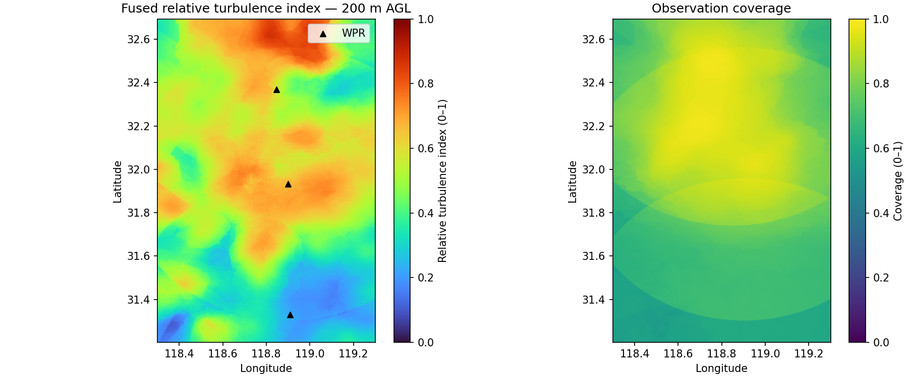
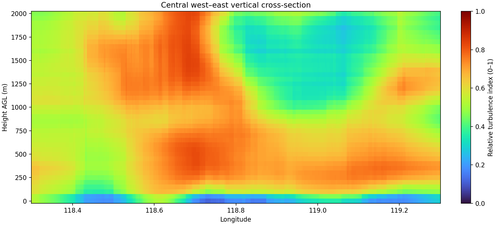
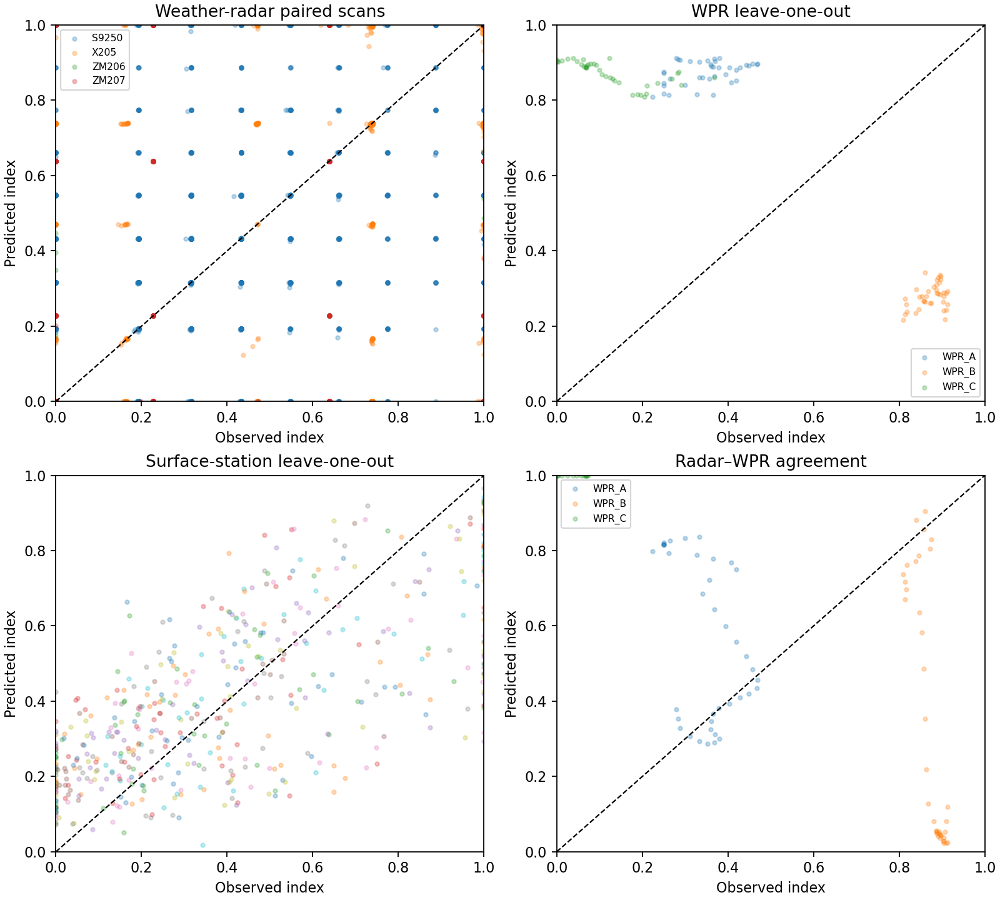
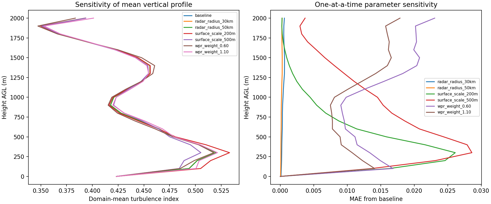

# 2025 年“华为杯”中国研究生数学建模竞赛 D 题——第二问

题目名称：**低空湍流监测及最优航路规划**。

本项目融合 S/X 波段天气雷达、3 部风廓线雷达和地面自动气象站，构建 2025-07-31 02:00、0–2000 m 低空三维湍流场。不同设备的观测量先转换为 0–1 无量纲相对指数，再按时间、距离、覆盖度和不确定度融合。

> **重要说明：**本项目输出的是“多源相对湍流强度指数”，用于识别相对高风险区。在没有飞机颠簸或 EDR 实测标定时，不应将其解释为 EDR 绝对真值。

## 数据与预处理

本仓库保留了复现第二问所需的紧凑数据子集：

| 数据源 | 规模 | 主要观测量 | 在模型中的作用 |
|---|---:|---|---|
| S9250、X205、ZM206、ZM207 天气雷达 | 10,410 条有效匹配记录，540 个站点位置 | 谱宽 SW、径向速度 VEL、距离、波束高度 | 湍流主要三维观测源 |
| A/B/C 三部风廓线雷达 | 77 个有效高度层，其中 66 个位于 0–2 km | 五波束谱宽、风向、水平风速、垂直速度 | 垂直剖面与风切变信息 |
| 地面自动气象站 | 原表 559 站，505 站风向风速有效 | 经纬度、海拔、风向、风速 | 近地层水平风场代理指标 |
| 第一问空间模型 | 1 个 `joblib` 模型及训练样本摘要 | 高度、垂直速度、平滑风切变 | 仅用于训练域外诊断，不直接进入融合 |

### 天气雷达数据边界

原始天气雷达体扫数据体积数百 MB，不适合直接提交到普通 GitHub 仓库。`data/radar_matches.xlsx` 是从原始雷达数据提取并与地面站位置匹配后的中间表，保留了雷达编号、扫描时间、仰角、距离、波束高度、SW 和 VEL 等建模必需字段。

因此，本仓库可从“雷达匹配表＋官方 WPR/地面站文件”完整复现三维融合，但不包含从雷达原始体扫文件到匹配表的大文件预处理阶段。

### 数据质量控制

- 天气雷达只保留目标时刻附近、波束高度 0–2500 m 的有效 SW 记录；
- 风廓线雷达只使用 RAD 文件的首个低空模式，避免中高空模式的重复高度混入；
- 每个 WPR 高度层以五波束谱宽中位数为主指标，波束间中位绝对偏差用于不确定度；
- 地面站中缺失或异常风向风速记录不参与融合；
- 无观测支撑或总覆盖度低于 0.05 的网格保持 `NaN`，不填充为零湍流。

## 模型

### 1. 天气雷达谱宽订正

在同一部雷达、同一扫描时刻和仰角内，使用相邻匹配站径向速度拟合局地速度梯度。速度梯度在有限波束宽度内造成的非湍流谱展宽估计为

\[
\sigma_{\mathrm{shear}}
=\frac{D_{\mathrm{beam}}\lVert\nabla V_r\rVert}{\sqrt{12}},
\qquad
D_{\mathrm{beam}}=R\theta_b,
\]

其中波束宽度 \(\theta_b=1^\circ\)。订正后湍流谱宽为

\[
\sigma_t=
\sqrt{\max\left(
\sigma_{\mathrm{obs}}^2-
\sigma_{\mathrm{shear}}^2-
\sigma_{\mathrm{noise}}^2,
0\right)}.
\]

仪器噪声底取各雷达正谱宽中位数的 25%，并限制在 0.10–0.50 m/s。随后对每部雷达分别按订正谱宽的 Q10–Q90 映射为 0–1 相对指数，避免不同波段与量程直接混合。

### 2. 风廓线雷达指标

气象风向转换为东向和北向风分量 \(u,v\)，对垂直剖面做居中五层平滑，计算第一问使用的垂直风切变：

\[
S=\sqrt{\left(\frac{\partial u}{\partial z}\right)^2+
\left(\frac{\partial v}{\partial z}\right)^2}.
\]

再结合垂直速度 \(w\) 构造动力代理量：

\[
P=\sqrt{\left(\frac{S}{0.01}\right)^2+
\left(\frac{|w|}{3}\right)^2}.
\]

WPR 最终指数由 75% 五波束谱宽指标和 25% 风切变/垂直运动指标组成。第一问训练模型的预测仅作域外诊断；第二问 0–2 km 的 66 个 WPR 样本全部超出第一问训练域，因此该预测不直接参与定量融合。

### 3. 地面站代理指标

地面湍流代理量综合本站风速和周围六站的风矢量差异，再用 Q10–Q90 映射到 0–1。由于地面观测不能无限外推到高空，其垂直覆盖度按

\[
C_s(z)=C_s(0)\exp\left(-\frac{z}{300}\right)
\]

随高度衰减。

### 4. 空间插值与多源融合

三类数据源分别进行带有限影响半径的距离反比插值。第 \(s\) 类传感器的融合权重为

\[
w_s=\frac{\alpha_s C_s}{\sigma_s^2+0.1^2},
\qquad
T=\frac{\sum_s w_sT_s}{\sum_s w_s},
\]

其中 \(C_s\) 为覆盖度，\(\sigma_s\) 为单源不确定度，\(\alpha_s\) 为数据源基础权重。最终不确定度同时包含单源误差和传感器间分歧。

| 参数 | 默认值 |
|---|---:|
| 天气雷达水平影响半径 | 40 km |
| 风廓线雷达水平影响半径 | 70 km |
| 地面站水平影响半径 | 30 km |
| 雷达 / WPR / 地面站基础权重 | 1.00 / 0.85 / 0.65 |
| 地面站垂直衰减尺度 | 300 m |
| 高风险指数阈值 | 0.65 |

## 正式计算结果

正式网格范围为 118.2994°E–119.3002°E、31.2028°N–32.6931°N，网格规模为
\(946\times1660\times41\)，共 64,384,760 个三维格点。

| 高度 AGL | 平均湍流指数 | P90 | 平均覆盖度 | 平均不确定度 | 主要数据源 |
|---:|---:|---:|---:|---:|---|
| 0 m | 0.4211 | 0.7408 | 0.9703 | 0.3914 | 地面站 |
| 200 m | 0.5047 | 0.6934 | 0.7849 | 0.4547 | 三源共同贡献 |
| 500 m | 0.4837 | 0.7055 | 0.7640 | 0.4538 | 天气雷达＋WPR |
| 1000 m | 0.4255 | 0.6518 | 0.7363 | 0.4670 | 天气雷达 |
| 1500 m | 0.4478 | 0.6438 | 0.7136 | 0.4972 | 天气雷达＋WPR |
| 2000 m | 0.3966 | 0.6252 | 0.6237 | 0.5819 | 天气雷达＋WPR |

主要结论：

- 区域平均湍流指数在约 300 m 达到最大值 0.5241；
- 指数不低于 0.65 的高值网格比例在约 350 m 达到最大值 29.13%；
- 主要相对高值高度带为 0–300 m 和 350–900 m；
- 200 m 高值中心偏北，500 m 以上的显著高值区逐步转向区域中部；
- 随高度增加，地面站贡献快速减小，中高层主要由天气雷达和 WPR 支撑；2 km 处平均覆盖度下降、不确定度上升。





## 验证

第二问没有飞机湍流真值，因此采用多种内部与跨传感器检验，而不把任一传感器当作绝对真值。下表先分别计算每个留出设备的指标，再按其有效样本数加权平均；逐设备原始结果见 `results/validation_metrics.csv`。

| 验证方法 | 样本数 | MAE | RMSE | Pearson \(r\) | 高值 F1 |
|---|---:|---:|---:|---:|---:|
| 地面站留一 | 505 | 0.1888 | 0.2309 | 0.6933 | 0.5714 |
| 同一天气雷达相邻扫描重复性 | 5,065 | 0.2879 | 0.4468 | 0.3822 | 0.6686 |
| 留一天气雷达压力测试 | 41,505 | 0.3557 | 0.4272 | -0.0174 | 0.3239 |
| WPR 留一压力测试 | 117 | 0.6226 | 0.6271 | 0.0307 | 0.0000 |
| 天气雷达–WPR 跨传感器一致性 | 93 | 0.4833 | 0.5651 | -0.6287 | 0.1973 |

地面站空间留一结果较好，天气雷达相邻扫描对高值区具有一定重复性。但不同天气雷达之间、3 部 WPR 之间以及天气雷达与 WPR 之间的一致性较弱。这反映了不同设备观测机理、量程和空间代表性的差异，也是最终产品必须同时输出覆盖度与不确定度的原因。



## 敏感性分析

使用 2 km 水平、100 m 垂直粗网格，对雷达影响半径、WPR 权重和地面站垂直衰减尺度做单因素试验：

| 场景 | 相对基准场 MAE | 与基准场相关系数 |
|---|---:|---:|
| 雷达半径 30 km | 0.00042 | 0.99999 |
| 雷达半径 50 km | 0.00019 | 1.00000 |
| WPR 权重 0.60 | 0.01460 | 0.99362 |
| WPR 权重 1.10 | 0.01167 | 0.99603 |
| 地面衰减尺度 200 m | 0.00730 | 0.99710 |
| 地面衰减尺度 500 m | 0.01291 | 0.99411 |

所有场景与基准场的相关系数均高于 0.993，全场 MAE 均低于 0.015。在已测试范围内，大尺度垂直结构对参数扰动较稳定；WPR 权重和地面站垂直尺度的影响大于雷达水平半径。



## 仓库结构

```text
2025-D-Question2-Turbulence-Fusion/
├── main.py                  # 唯一 Python 程序
├── README.md
├── requirements.txt
├── data/                    # 运行所需的全部紧凑输入数据
│   ├── radar_matches.xlsx
│   ├── surface_stations.xlsx
│   ├── radar_sites_local_coords.csv
│   ├── wpr_[a-c]_rad.txt / wpr_[a-c]_robs.txt
│   ├── model_b_spatial.joblib
│   └── model_b_predictions.csv
└── results/                 # 已计算并提交的紧凑结果
    ├── level_summary.csv
    ├── turbulence_z0200m_sample_1km.csv
    ├── radar_station_profiles.csv
    ├── wpr_profiles.csv
    ├── surface_station_proxies.csv
    ├── source_diagnostics.csv
    ├── validation_metrics.csv
    ├── sensitivity_metrics.csv
    ├── formal_meta.json
    ├── gis_manifest.csv / sensor_points.geojson
    └── figures/
```

`results/turbulence_z0200m_sample_1km.csv` 是从正式 100 m 结果每 10 个水平网格抽样得到的 1 km 展示数据，包含湍流指数、覆盖度、不确定度和三类数据源贡献率。完整 41 层 NPZ/GeoTIFF 约 1.4 GB，可通过下文命令重新生成，不直接提交到 GitHub。

## 环境与运行

建议使用 Python 3.10 或更高版本。

```bash
python -m venv .venv
source .venv/bin/activate       # Windows: .venv\Scripts\activate
python -m pip install -U pip
python -m pip install -r requirements.txt
```

在 Spyder 或 PyCharm 中打开 `main.py` 后直接点击“运行”，程序默认执行正式网格计算，等价于：

```bash
python main.py run
```

正式参数为水平 100 m、垂直 50 m、0–2000 m，共 41 层。结果写入 `outputs/q2_0200_fusion/`，需预留约 1.4 GB 磁盘空间。

如果只想先做数秒级快速检查，在命令行中运行：

```bash
python main.py quick
```

也可在命令行中显式执行正式网格计算：

```bash
python main.py run
```

```bash
python main.py validate       # 交叉验证与跨传感器检查
python main.py sensitivity    # 7 组关键参数敏感性试验
python main.py gis            # 导出 EPSG:4326 GeoTIFF 和 GeoJSON，需先运行 run
python main.py all            # 顺序执行正式计算、验证、敏感性和 GIS 导出
python main.py --help
python main.py run --help
```

`run` 的完整输出包括：

- `levels/z_####m.npz`：每层湍流指数、覆盖度、不确定度和三源贡献率；
- `meta.json`：网格范围、高度层、输入和融合参数；
- `level_summary.csv`：逐高度均值、P90、覆盖度和不确定度；
- 三类数据源的站点剖面与诊断 CSV；
- 代表高度平面图、中央垂直剖面和三维高值区。

## 适用边界与局限

- 本指数没有用飞机颠簸或 EDR 观测标定，只能用于相对空间风险排序；
- 天气雷达输入是从原始体扫数据整理的匹配表，仓库不包含大体积原始雷达文件的全部预处理链；
- 数据只对应 2025-07-31 02:00 附近的单一天气过程，不能直接外推到其他季节、地形和天气类型；
- 三部 WPR 数量较少，且彼此与天气雷达的交叉验证较弱，局地高值不宜被解释为独立真值；
- 第一问模型在第二问 WPR 数据上整体处于训练域外，因此仅用于诊断，不作为融合真值；
- 地面站的 300 m 垂直衰减、各源影响半径和基础权重是建模参数，已做局部敏感性检查，但不代表已完成多天气过程标定；
- 随高度增加，观测覆盖度降低、不确定度增大，使用时应与湍流指数联合解读。

## 数据与代码使用说明

竞赛数据来自题目附件，本项目仅用于数学建模研究与结果复现。将仓库设为公开之前，请再核对竞赛数据的公开和转发要求；代码许可证与数据使用权应分开说明。
