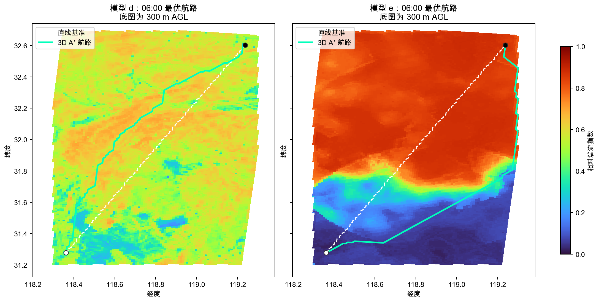
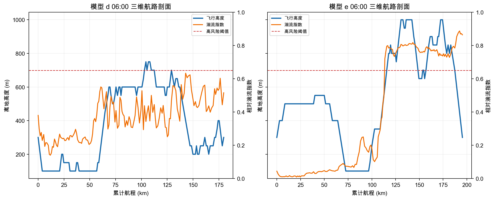

# 2025 年“华为杯”中国研究生数学建模竞赛 D 题——第三问

题目名称：**低空湍流监测及最优航路规划**。

本工程承接第一问的风切变/Ri 思路和第二问的多源相对湍流指数，完成：

- 用 02:00--05:00 连续观测构建模型 c 验证场；
- 从数值天气预报数据建立模型 d，订正后预报到 08:00；
- 在不使用数值预报的条件下建立非线性模型 e，外推 05:30 和 06:00；
- 对模型 d/e 的 06:00 湍流场分别做三维 A* 航路规划。

> 结果是 0--1 无量纲的**相对湍流指数**，用于风险排序，不是经飞机观测标定的 EDR 绝对真值。

本仓库已经整理为可移植版本：程序只读取项目内的 `data/`，不依赖作者电脑上的赛题目录或其他工程路径。`data/` 中包含约139 MB的紧凑输入，每个文件均小于 GitHub 的100 MB单文件限制。

## 1. 统一网格与模型 c 验证场

数值预报原生水平分辨率为 1 km。为避免将粗网格人为伪精细化，比较与订正均在该原生网格上完成；垂直方向插值到 0--2000 m AGL、间隔 50 m，共41层。计算域为第二问地面站包络矩形，共14,229个有效水平格点。

模型 c 沿用第二问的数据源口径：

1. **S/X 波段天气雷达**：在地面站位置采样 SW 和 VEL，利用邻站径向速度差估计波束内切变展宽，扣除切变与仪器噪声后，各雷达分别用 Q10--Q90 映射到0--1。
2. **风廓线雷达**：五波束谱宽中位数占75%，第一问使用的平滑垂直风切变与垂直速度代理量占25%。
3. **地面自动站**：结合本站风速和周围六站风矢量差，垂直覆盖按 `exp(-z/300)` 衰减。
4. **融合**：各源独立做有限半径 IDW，再按“基础可信度×覆盖度/不确定度方差”融合，同时保留覆盖度和不确定度。

因此这里的“模型 c 验证场”是第二问 100 m 产品在数值预报网格上的同口径重建，专用于 c/d 公平比较。

为避免在 GitHub 中提交约9.5 GB雷达原始文件，仓库将上述融合结果保存为 `data/model_c_validation_1km_50m.npz`；模型 d/e 的训练、验证和航路规划仍由 `main.py` 重新完成。

## 2. 模型 d：数值预报湍流诊断与订正

对每个 WRF 文件的位温 `TT`、东西风 `Ua`、南北风 `Va`、垂直风 `Wa`和位势高度 `Z` 做统一 AGL 插值，构造六类特征：

- 垂直风切变 `S`;
- 基于梯度理查逊数的不稳定风险 `sigmoid((0.25-Ri)/0.25)`;
- Ellrod 类指数 `S × (水平变形 + |散度|)`;
- 3×3×3 邻域风分量方差得到的局地脉动能量；
- `|Wa|` 垂直运动；
- 随高度指数衰减的地形坡度强迫。

各特征用 02:00--05:00 数值预报场的 Q10--Q90 归一化，物理初值为

$$
T_{d,0}=0.25S+0.20R_i+0.20E+0.15K+0.10W+0.10G.
$$

在此基础上，加入半小时变化率和高度，用直方图梯度提升回归模型学习模型 c 相对指数。强度回归保持无权训练，另训练一个高风险预警分支；该分支对 `c >= 0.65` 样本赋予 3 倍代价，用于降低漏报，不取代连续湍流强度场。

验证不做随机打散，而是使用滚动时序阻塞：依次使用所有过去时次预测03:30、04:00、04:30和05:00。

| d 模型 | 样本数 | MAE | RMSE | Pearson r | 高风险 F1 |
|---|---:|---:|---:|---:|---:|
| 未订正物理组合 | 120,000 | 0.3737 | 0.4435 | 0.0729 | 0.2056 |
| 非线性强度订正 | 120,000 | **0.2310** | **0.2610** | **0.3499** | 0.0875 |
| 独立高风险预警分支 | 120,000 | — | — | — | **0.6441** |

订正使 RMSE 下降 41.1%，相关系数明显提高。但 `r=0.3499` 表明 1 km 数值模式对百米级局地湍流结构的解释能力仍有限，故产品同时给出不确定度和预警得分。

## 3. 模型 e：无数值预报的非线性外推

模型 e 只使用模型 c 历史场。对每个网格构造当前值、前两个滞后值、一阶变化、二阶加速度、3×3局地均值、水平梯度和高度特征，用非线性梯度提升模型做 30 min 一步预测，再递归到 06:00。

严格保留最后一个可验证转移作为后验：

| e 模型 | 样本数 | MAE | RMSE | Pearson r | 高风险 F1 |
|---|---:|---:|---:|---:|---:|
| 持续性基准 | 35,000 | 0.0723 | 0.0998 | 0.9465 | 0.9197 |
| 非线性时空外推 | 35,000 | **0.0645** | **0.0918** | **0.9491** | **0.9387** |

模型 e 在短时外推上优于简单持续性。但高指标主要表明 30 min 尺度的场具有强持续性，不能代表多天气过程上的泛化性。

06:00 时，模型 d/e 全场平均指数分别为 0.5293 和 0.6094，两场 MAE 为 0.2550、空间相关系数为 0.4798。两种方法分歧较大，是实际使用时必须保留的情景不确定性，不应只报一条确定结论。

## 4. 三维最优航路

题目文件未包含可机读的起终点坐标，因此程序将其参数化。正式示例默认使用：

- 起点 `(118.36°E, 31.28°N, 300 m AGL)`;
- 终点 `(119.24°E, 32.60°N, 300 m AGL)`;
- 允许高度 100--1000 m AGL。

在 1 km×1 km×50 m 网格上使用三维 A*，每个水平步最多升降一层，边代价为

$$
J_e=\Delta s\left(1+8\bar T^3\right),
$$

其中 `Δs` 保证航路不会为追求极小湍流而无限绕行，`ŪT` 为边两端的平均湍流指数。

| 06:00 场 | 航路 | 长度/km | 平均湍流 | 最大湍流 | 高风险节点比例 | 累积暴露/km |
|---|---|---:|---:|---:|---:|---:|
| 模型 d | 直线 | 176.75 | 0.5581 | 0.6849 | 9.33% | 98.82 |
| 模型 d | 3D A* | 179.75 | **0.3682** | **0.6336** | **0%** | **67.39** |
| 模型 e | 直线 | 176.75 | 0.5975 | 0.8823 | 62.00% | 105.77 |
| 模型 e | 3D A* | 195.32 | **0.4150** | 0.8872 | **46.99%** | **73.89** |

模型 d 航路仅增加1.70%长度，累积湍流暴露下降31.81%；模型 e 航路增加10.50%长度，累积暴露下降30.14%。模型 e 场的广泛高值使得完全避开高风险不可能，这也说明“不同预报情景应各给一条航路”比强行合并为一条更透明。





## 5. 运行

Python 3.10 或更高版本：

```bash
python -m pip install -r requirements.txt
python main.py quick
python main.py all
```

所有输入固定从 `data/` 读取，不需要也不接受本机数据路径。指定起终点和高度限制：

```bash
python main.py all \
  --start 118.40 31.35 300 \
  --end 119.20 32.55 300 \
  --min-altitude 100 \
  --max-altitude 1000
```

仓库默认读取紧凑数据，完整运行不需要原始雷达 CSV。若研究者自行把官方原始资料按 `data/README.md` 所列目录放入 `data/`，程序仍保留原始资料解析能力。

运行测试：

```bash
python -m unittest discover -s tests -v
```

## 6. 输出文件

| 文件 | 内容 |
|---|---|
| `main.py` | 全部数据解析、c/d/e 模型、验证、预报、航路与绘图 |
| `data/model_c_validation_1km_50m.npz` | 由天气雷达、风廓线雷达和地面站融合得到的模型 c 紧凑输入 |
| `data/nwp/grid.npz` | 裁剪后的1 km水平网格、地形和掩膜 |
| `data/nwp/nwp_regular_*.npz` | 12个预报时次的位温与三维风场，已插值到统一高度层 |
| `results/model_c_validation_1km_50m.npz` | 02:00--05:00 模型 c 验证场、覆盖度和不确定度 |
| `results/model_d_forecast_1km_50m.npz` | 02:00--08:00 模型 d 强度、预警得分和不确定度 |
| `results/model_e_forecast_1km_50m.npz` | 05:30/06:00 模型 e 强度和不确定度 |
| `results/validation_metrics.csv` | d/e 验证总指标 |
| `results/model_d_validation_by_time.csv` | d 每个滚动验证时次的指标 |
| `results/forecast_level_summary.csv` | 每个时次、高度的均值、P90、高值比例和不确定度 |
| `results/optimal_route_model_[d/e]_0600.csv` | 每个航路节点的经纬度、高度和湍流指数 |
| `results/optimal_routes_0600.geojson` | 可在 GIS 软件中打开的三维航路 |
| `results/route_metrics.csv` | 最优航路与直线基准的定量比较 |
| `results/run_summary.json` | 网格、标定参数、数据缺口和航路假设 |

## 7. 数据缺口与适用边界

- 官方目录中缺少 06:00 数值预报文件，程序用 05:30 与 06:30 模型 d 诊断场线性插值，并在 `run_summary.json` 中标记；
- 题目文档没有可机读的起终点/允许区域坐标，当前航路是可替换的示例计算；
- 模型 d 只能解释数值模式可解尺度的湍流环境，不能凭 1 km 输入真实恢复百米以下涡旋；
- 模型 e 只有单一三小时过程可训练，目前证据仅支持短时外推；
- 航路代价只含航程和湍流暴露，尚未纳入禁飞区、地形净空、风场油耗、爬升率、电量和空域容量约束。
